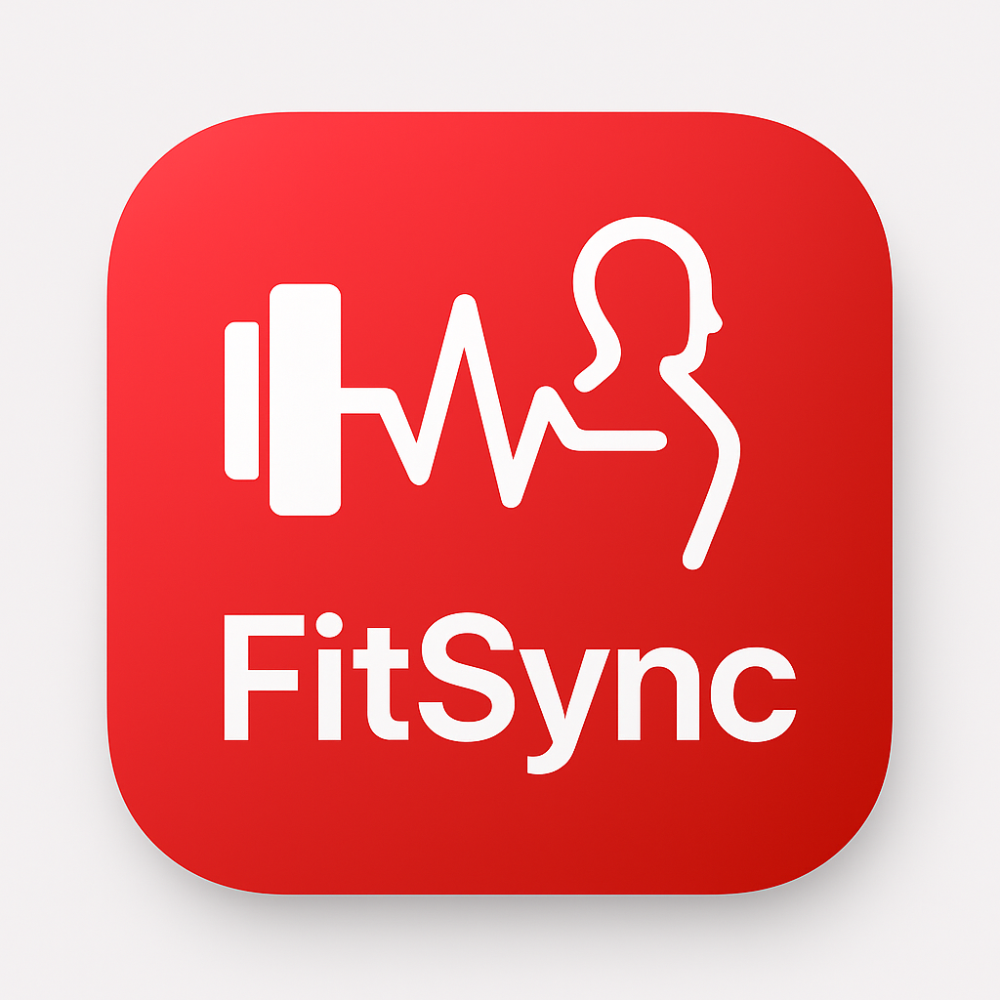

  

<h1 align="center">🏋️‍♂️ FitSync</h1>

  <strong>Tu compañero inteligente de entrenamiento y bienestar</strong> 
  App móvil HealthTech para rutinas personalizadas, comunidad fitness y gamificación.

---

## 📋 Descripción

**FitSync** es una aplicación móvil desarrollada como proyecto de TFG (DAM) por **Marcos Castillo**, **José Morillas** y **Pablo Pomares**.  
El objetivo es ofrecer una plataforma fitness que combine tecnología, personalización y comunidad.  

Los usuarios podrán:
- Crear rutinas de entrenamiento personalizadas según su nivel, metas y salud.
- Unirse a retos semanales y eventos globales.
- Competir en rankings y desbloquear logros.
- Conectarse con amigos y compartir progresos.
- Recibir notificaciones inteligentes para mantener la motivación.

---
